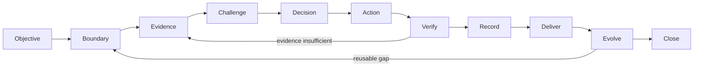

# Evidence-Gated Agentic Workflow

一套以「可信真相、清楚邊界、可驗證閉環」為核心的人類 × AI 工作系統。

狀態：`v0.1 reference model`。`Evidence-Gated Agentic Workflow` 是本 repository 自定義的描述性名稱，不是正式標準、安全認證、formal assurance case，也尚未以 benchmark 證明 operational effectiveness。

這不是一組萬能 prompts，也不是要求 AI 無限制自治。它是一個可落地的 operating model：先決定真正目標與權限邊界，讓 AI 在正確 context、tools 與 safeguards 中執行，再以 tests、live evidence、正式記錄和 human verdict 收口。

> Public edition：本 repository 只保留可分享的方法、流程、模板與概念定位。它刻意排除原始對話、Memory、審計底稿、推理過程、個人路徑、帳號狀態、客戶與專案識別資料。

## 一句話版本

```text
Objective → Boundary → Evidence → Challenge → Decision
→ Smallest Reversible Action → Verify → Record → Deliver → Evolve → Close
```



## 這套方法解決什麼

- AI 在錯的 repository、資料源或帳號中做對的事情。
- 把 configured、installed 或 HTTP 200 誤說成真正可用或業務成功。
- 用舊記憶回答 current-state 問題。
- 把 unit test、局部 smoke 或 package existence 誇大成 end-to-end 完成。
- 任務做完了，但做法沒有變成下一次可重用的資產。
- 為了「更 agentic」而放棄 authority、accountability 與 recoverability。
- 規則越寫越多，卻不知道哪些 gate 真正有效。

## 核心 profile

這套 workflow 最準確的定位是：

> **Harness-centric、Loop-aware、human-orchestrated、bounded-autonomy。**

- Prompt 是控制入口，不是整個系統。
- Context 是資訊平面，負責把正確資料帶到正確決策。
- Harness 是 execution substrate，負責 tools、permissions、environment、tests、receipts 與 recovery。
- Loop 是 feedback topology，讓 investigate → act → verify → record → improve 可以重跑。
- Human 保留 outer loop：objective、risk、taste、high-impact approval、evidence sufficiency 與 consequence ownership。

這些不是正式、線性、互斥的「AI 發展世代」。詳見[方法論定位](docs/04-methodology-positioning.md)。

## 三速工作模式

| Mode | 適用 | 最低要求 |
| --- | --- | --- |
| Fast | 可逆、局部、低風險 | boundary + smallest action + readback |
| Standard | 一般實作、正式文件、可控資料操作 | brief + evidence + targeted verification + record |
| Assured | production、customer、auth、permissions、destructive、external publication | challenge gate + explicit authority + rollback/remediation + multi-layer evidence |

不要讓所有工作都進 Assured；也不要讓高風險工作偽裝成 Fast。

## 快速開始

1. 複製 [`templates/task-brief.md`](templates/task-brief.md)，填寫 objective、boundary、authority、closure target。
2. 選擇 Fast、Standard 或 Assured。
3. 先收集足以改變決策的 evidence，不做無差別掃描。
4. 執行最小、可逆、可驗證的 action。
5. 用 [`templates/verification-report.md`](templates/verification-report.md) 限制完成聲明。
6. 將 current truth 回寫到真正有權威的層。
7. 只有重複出現且穩定的做法，才升級為 runbook、Skill、helper、test 或 eval。

## 導覽

- [核心原則](docs/01-core-principles.md)
- [端到端 Operating Loop](docs/02-operating-loop.md)
- [AI/Codex 協作堆疊](docs/03-ai-collaboration-stack.md)
- [方法論定位](docs/04-methodology-positioning.md)
- [風險、授權與決策權](docs/05-risk-authority-and-decision-rights.md)
- [驗證、交付與 Closure](docs/06-verification-delivery-and-closure.md)
- [把重複成功演化成系統](docs/07-system-evolution.md)
- [採用指南](docs/08-adoption-guide.md)
- [可直接套用的模板](templates/README.md)
- [Codex adapter](integrations/codex/README.md)
- [三個 fictional end-to-end examples](examples/README.md)

## 不主張什麼

- 不主張所有任務都應 autonomous。
- 不主張規則多就代表成熟度高。
- 不主張任何一次成功能證明 system-wide reliability。
- 不主張所有 defect 都應 strict TDD。
- 不主張 spec 永遠比 current code/runtime 更真；authority 要按問題路由。
- 不主張這是唯一正確流程。它是一套可裁剪的 reference architecture。
- 不主張採用本流程即可保證 agent 正確、安全或 compliant。

## License

原始編纂與授權者：[Alex0158](https://github.com/Alex0158)。

文字、圖表與模板採 [Creative Commons Attribution 4.0 International](LICENSE) 授權。你可以分享與改作，但請保留適當署名與授權連結。

參與前請看 [Contributing](CONTRIBUTING.md)；內容裁決見 [Governance](GOVERNANCE.md)；敏感資料請依 [Security and privacy](SECURITY.md) 私下回報。
