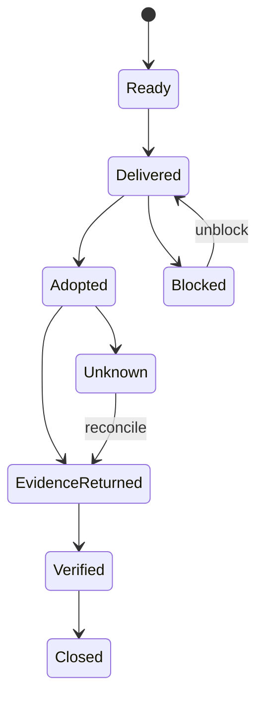

# 06 — 驗證、交付與 Closure

## 1. Progressive verification ladder

驗證不是單一 `tests passed`。按風險與 claim 逐層上升：

### Level 1 — Static / readback

- exact diff、schema、route、config shape；
- record/page/file 回讀；
- link、syntax、manifest structure。

支持「變更存在／結構正確」，不支持 runtime 或 business success。

### Level 2 — Targeted

- 本次範圍的 unit/integration/focused check；
- positive、negative、boundary case。

支持指定 contract，不代表 full regression coverage。

### Level 3 — Full suite

只有實際執行完整 suite 才能寫「full suite passed」。仍需說明 suite 沒覆蓋的 runtime、data 或 external surfaces。

### Level 4 — Runtime smoke

- 真實 process/container/service；
- live config/data connection；
- browser/API path；
- exact identity/environment。

### Level 5 — True-chain

包含真 UI operation、真 core API/data flow、跨角色或 state transition，以及閉環 assertion。HTTP 200、stub 或 mock-only smoke 不等於 true-chain。

### Level 6 — Artifact freshness

把 source、build、artifact 與 runtime binding 分開：

- source commit / dirty state；
- build command/result；
- artifact timestamp/checksum/manifest；
- deployed runtime 實際使用哪個 artifact/config。

### Level 7 — External/user closure

- artifact 已交付；
- operator 已執行；
- evidence 已返回；
- target state 已驗證；
- rollback/remediation 可用；
- residual risk 有 owner。

## 2. Claim–evidence fit

驗證報告必須寫：

1. 執行了什麼；
2. 通過了什麼；
3. 沒執行什麼；
4. 哪個 gate/blocker 阻止更高層驗證；
5. 現有 evidence 最多支持什麼 claim；
6. residual risk 與 owner。

推薦使用精確狀態：

- `implemented, static-verified`；
- `targeted tests passed, full suite not run`；
- `packaged, runtime binding unverified`；
- `delivered, adoption pending`；
- `remote outcome unknown, reconciliation pending`；
- `verified and closed`。

## 3. Maker、checker 與 verdict

AI 可以同時實作和自檢，但高風險 work 應增加不同 failure surface：

- static scanner；
- test/runtime evidence；
- separate reviewer/subagent；
- human verdict；
- external readback。

「另一個 agent 說 OK」只是一項 review signal。Independent verification 的重點是證據來源與失敗模式是否真的不同。

## 4. Verification 也可能有副作用

以下不是 read-only：

- production 寄測試郵件；
- 建立或修改測試資料；
- 模擬 payment/order；
- restart/deploy；
- rollback；
- public smoke that sends notifications。

它們需要獨立 mutation authority、cleanup/remediation 與 receipt。沒有授權時，誠實停在較低 closure level。

## 5. Delivery lifecycle

- **Ready**：artifact 本地完成。
- **Delivered**：已到 downstream owner/target。
- **Adopted**：已執行或採用。
- **Evidence returned**：有 receipt、readback、logs、screenshots 或 live data。
- **Verified**：evidence 足以支持 intended claim。
- **Closed**：formal truth、risk owner 與 handoff 都已收口。

## 6. Self-contained handoff

每個 handoff 最少包含：

- objective 與 target outcome；
- baseline → target；
- exact changed artifacts；
- operator、approver、verifier；
- prerequisites 與 environment/account boundary；
- exact steps；
- expected evidence；
- rollback/remediation；
- non-goals、known risks、stop condition。

不要要求接手者回頭閱讀整條 chat 才能執行。

## 7. Git 不等於 closure

Git commit/push 能證明內容被版本化與送到 remote，但不能自動證明：

- correct branch 已 deployment；
- artifact 是 fresh；
- runtime 使用新版本；
- formal data 已更新；
- user/customer 已採用；
- public links 對匿名使用者可用。

每個下游狀態都要自己的 evidence。

## 8. Closure budget

開始前選 closure target，避免無限延長：

| Target | 含義 |
| --- | --- |
| Answered | 問題已由足夠 evidence 回答 |
| Diagnosed | root cause/likely cause 與未驗證邊界清楚 |
| Implemented | change 已完成並通過最低本地驗證 |
| Integrated | owning surfaces 與 contracts 已同步 |
| Runtime-verified | 指定 live path 已驗證 |
| Delivered | downstream 已收到完整 handoff |
| Externally closed | adoption、readback、risk 全部收口 |

不是每個任務都需要最高層；但必須誠實命名目前在哪一層。
